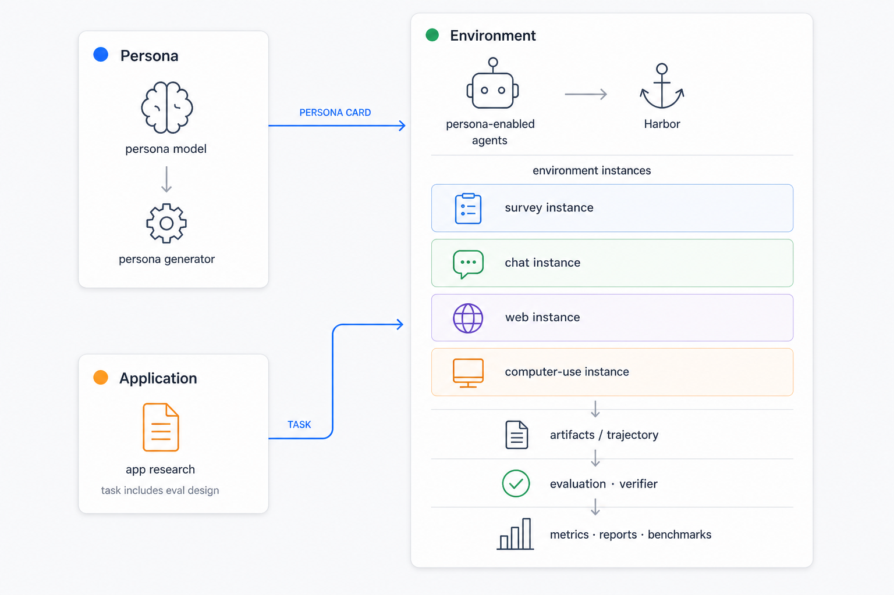

# MatrAIx

[](LICENSE)
[](https://www.python.org/)
[](https://discord.gg/vruP88PTZ)

> **Simulate before reality.**

Large-scale, persona-driven agent simulation — test products, conversations, and
workflows before they hit real users.


MatrAIx pairs synthetic personas with LLM agents in reproducible Harbor
tasks: surveys, chat, live web, and desktop computer-use. The name nods to
*The Matrix* — a simulated world useful for exploration, not a replacement for
real people.

**North star:** toward **8.3B** persona-scale simulation (one synthetic profile
per person on Earth). Today the repo ships a working minimal stack you can run
locally with Docker.

---

## Requirements

- [Docker](https://docs.docker.com/get-docker/)
- [uv](https://docs.astral.sh/uv/) and Python 3.12
- Node.js 20+ (Playground / viewer frontends only)
- Model API keys for persona-agent examples — [choosing-an-agent.md](application/choosing-an-agent.md)

---

## Installation

```bash
git clone <your-fork-url> && cd MatrAIx
uv venv --python 3.12
uv pip install -e .
uv pip install pytest pytest-asyncio httpx
uv pip install -e packages/playground
uv pip install -e packages/harbor-langsmith
uv pip install -e packages/rewardkit
uv pip install -e environment/adapters/simpleqa
```

All Harbor commands: **`uv run harbor …`**

---

## Quick start

**Smoke** (terminal — all teams, no API key):

```bash
uv run harbor run -c configs/jobs/example-job-recipe/harbor-smoke-local.yaml
```

**Application tasks** — follow [QUICKSTART.md](application/QUICKSTART.md) (terminal → batch → UI).
For interactive play, jump to [Playground §10](application/QUICKSTART.md#10-playground--play-tasks-visually)
(Node.js 20+).

Terminal batch runs (CI, scripts) use the same Harbor jobs, e.g.:

```bash
export ANTHROPIC_API_KEY="sk-ant-..."
uv run harbor run -c configs/jobs/example-job-recipe/appSim-example-survey-local.yaml
```

**Inspect** — Playground **Runs** for cohort debrief; `uv run harbor view jobs/<job_name> --build`
when you need raw ATIF trajectories, agent logs, or file-level artifacts.

More: [docs/running.md](docs/running.md) · [Architecture](docs/architecture.md)

---

## Teams

Three teams own the repo. Pick **one row** to onboard; details live in each
team's docs — not duplicated here.



| Team | Path | Scope | Start here |
|------|------|-------|------------|
| **Persona** | [`persona/`](persona/) | **Who** — data curation → dimension schema → grounding benchmarks | [docs/personas/README.md](docs/personas/README.md) |
| **Application** | [`application/`](application/) | **What** — scenarios, tasks, metrics; play & debrief in Playground | [QUICKSTART.md](application/QUICKSTART.md) · [Playground §10](application/QUICKSTART.md#10-playground--play-tasks-visually) |
| **Environment** | [`environment/`](environment/) | **How** — Harbor runtime, agents, task environments; harbor view for debug | [environment/README.md](environment/README.md) |

---

## Repository layout

```text
MatrAIx/
├── persona/           curation · schema · datasets · bench tasks · reporting
├── application/       tasks · task-spec · playground (Playground) · QUICKSTART
├── environment/       runtime/harbor · agents · task-environments · harbor view · adapters
├── docs/personas/     Persona team guides (data → schema → grounding)
├── configs/jobs/      curated Harbor recipes
├── packages/          playground · rewardkit · harbor-langsmith
├── jobs/              local Harbor run outputs (gitignored)
└── docs/              architecture · running · research
```

Harbor writes artifacts to `jobs/` when you run recipes from `configs/jobs/`; those outputs stay local and are not committed to `main`.

Large generated datasets stay outside git — [artifact handoff](migration/matraix/README.md).

---

## Join the project

Community onboarding only — **which team and which doc** are in the [Teams](#teams)
table above.

[](https://discord.gg/vruP88PTZ)
[](https://forms.gle/hwEHng5HGWRqcJue9)

1. Join Discord — nickname **`Full Name - Affiliation`**. Fill the Google Form
   (background, team placement, paper authorship / acknowledgements).
2. Open **Start here** for your team (Teams table).
3. Complete one hands-on pass in that doc. Application team: configure and run in
   **Playground**; use `harbor view` when you need low-level traces.
4. Read **[CONTRIBUTING.md](CONTRIBUTING.md)** before opening a PR.

---

## Vision

**Roadmap**

- **Stage 1 — Minimal stack.** Persona schema & dev pool; survey/chat/web/os-app tasks; adherence metrics; telemetry.
- **Stage 2 — Core dataset & benchmark.** Scaled cohorts, domain subsets, automatic evaluation.
- **Stage 3 — Environment expansion.** Long-horizon tasks, memory-enabled agents, multi-agent interaction, friction simulation.
- **Stage 4 — Simulated society.** Social graphs, group dynamics, information diffusion.

**Research questions** (cross-team)

- How should synthetic personas be represented, and how do we measure adherence?
- How consistent are LLM agents across long interactions?
- Can simulated users predict real user preferences?
- How do multi-agent simulations differ from single-agent feedback?
- Can lightweight self-evolving memory make agents better human stand-ins?
- What are the failure modes of persona-based simulation?

Literature: [docs/research/](docs/research/README.md)

---

## Star History

<a href="https://www.star-history.com/?repos=MatrAIx-ai%2FMatrAIx&type=date&legend=top-left">
 <picture>
   <source media="(prefers-color-scheme: dark)" srcset="https://api.star-history.com/chart?repos=MatrAIx-ai/MatrAIx&type=date&theme=dark&legend=top-left&sealed_token=qlhUK1GNCbwEzVBgvIljmXHDgwWEJn9XR0nA2HZ25C3PuehFlXS5of-7EPUIocdhmHKcdgt6GMKyP3VSKxZ7ZabWvWmqS66Jo_6FYLJ6IvwXgsLgnsjRzg" />
   <source media="(prefers-color-scheme: light)" srcset="https://api.star-history.com/chart?repos=MatrAIx-ai/MatrAIx&type=date&legend=top-left&sealed_token=qlhUK1GNCbwEzVBgvIljmXHDgwWEJn9XR0nA2HZ25C3PuehFlXS5of-7EPUIocdhmHKcdgt6GMKyP3VSKxZ7ZabWvWmqS66Jo_6FYLJ6IvwXgsLgnsjRzg" />
   
 </picture>
</a>

---

## License

Apache 2.0 — see [LICENSE](LICENSE).
