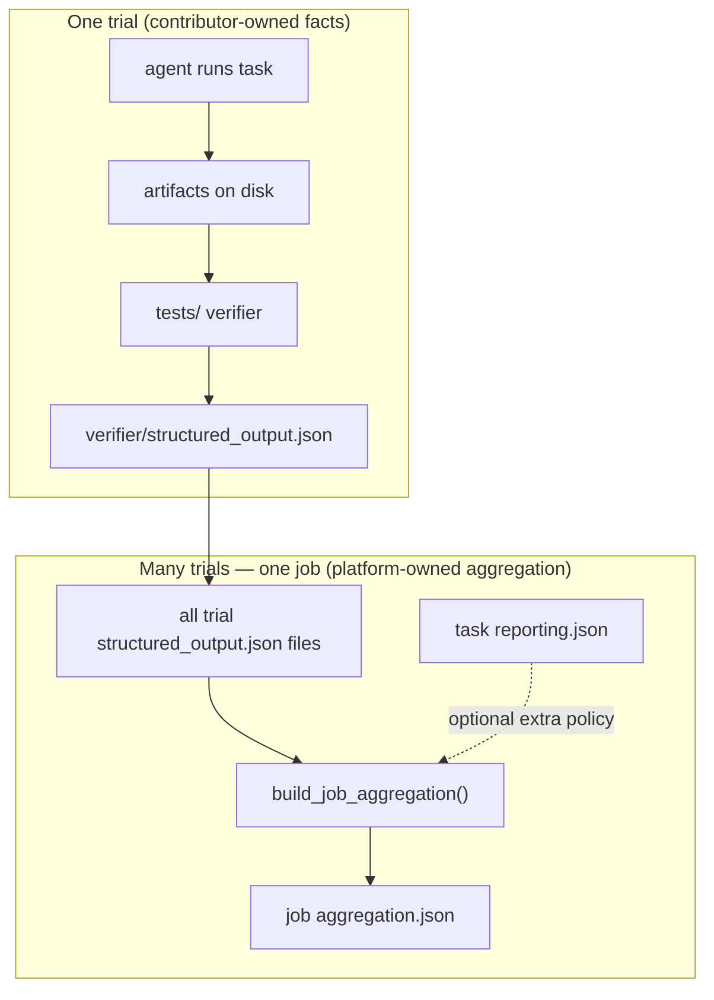
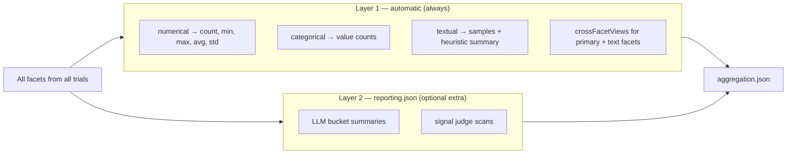
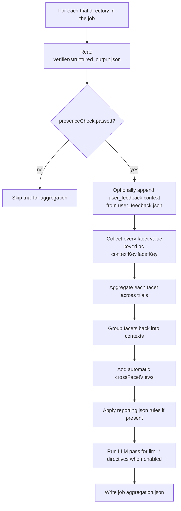

# Application Task Spec

This directory is the **authoring standard** for PersonaBench application
tasks. If you are adding or editing a task under `application/tasks/`, start
here.

**Doc map**

| If you need… | Read |
|---|---|
| Which files belong in a task folder | [Authoring bundle](#authoring-bundle) |
| How batch reporting works | [Reporting and evaluation](#reporting-and-evaluation) |
| **All task types — context/facet cheat sheet** | [**Structured output quick reference**](#structured-output-quick-reference-all-task-types) |
| Survey questionnaire + output schema | [`survey/README.md`](survey/README.md) |
| Chatbot artifacts + conversation metrics | [`chatbot/README.md`](chatbot/README.md), [`chatbot/eval_artifacts.md`](chatbot/eval_artifacts.md) |
| Web / browser task metrics | [`web/README.md`](web/README.md) |
| OS / app task metrics | [`os-app/README.md`](os-app/README.md) |
| Copy-paste job setup | [`../tasks/README.md`](../tasks/README.md), [`../task-guide.md`](../task-guide.md) |

Runnable examples live under `application/tasks/example-*`. Each task type also
has a **canonical task** listed in [Task type specs](#task-type-specs).

## Common Contract

Each application task defines these parts:

- Task instruction: what the simulated user is trying to accomplish.
- Interaction protocol: survey answers, chat turns, browser/computer-use actions,
  or native OS/app interaction flows.
- Task-specific environment: survey form, chatbot API sidecar, hosted web app, or
  OS/app state and artifacts.
- Stop conditions: max turns, max steps, explicit done action, or task failure.
- Artifacts: trajectory, application result, task outputs, logs, and optional browser traces.
- Evaluation contract: objective verifier when available, plus persona
  self-report after interaction.

## Authoring Bundle

Each runnable task lives under `application/tasks/<task-name>/` and always
includes `instruction.md`, `task.toml`, `tests/`, and `reporting.json`.
Supplementary files differ by application type:

### Survey

```text
instruction.md                 # short scenario; points to output_schema
reporting.json                 # batch aggregation policy (contextRules)
input/
  context.md                   # product concept (optional)
  questionnaire.yaml           # structured questions
  output_schema.md             # survey_result.json contract
```

### Chatbot

```text
instruction.md                 # conversation goal
reporting.json                 # batch aggregation policy (contextRules)
input/
  context.md                   # application background (optional)
  protocol.md                  # chat API / MCP contract (optional)
  chatbot.yaml                 # runtime connection metadata
  self_report_schema.yaml      # user_feedback.json
```

Platform-managed harness artifacts (`transcript.json`,
`application_result.json`) are documented in
[`chatbot/eval_artifacts.md`](chatbot/eval_artifacts.md), not in per-task files.

### Web / OS-app

```text
instruction.md                 # scenario + inline task-result JSON schema
reporting.json                 # batch aggregation policy (contextRules)
input/
  self_report_schema.yaml      # user_feedback.json (optional)
```

Web and OS/app tasks do **not** use `input/output_schema.md`. The submission
shape (for example `quote_choice.json` or `decision.json`) is written directly
in `instruction.md`, and the verifier enforces it. Persona self-report uses the
same `input/self_report_schema.yaml` convention as chatbot tasks.

### Quick reference

| Concern | survey | chatbot | web / os-app |
|---|---|---|---|
| Scenario | `instruction.md` | `instruction.md` | `instruction.md` |
| Background context | `input/context.md` | `input/context.md` | usually in `instruction.md` |
| Task result JSON | `input/output_schema.md` | platform-managed | inline in `instruction.md` |
| Persona self-report | — | `input/self_report_schema.yaml` | `input/self_report_schema.yaml` |
| Batch reporting policy | `reporting.json` | `reporting.json` | `reporting.json` |
| Structured questions | `input/questionnaire.yaml` | — | — |
| Transport / runtime | — | `input/protocol.md`, `input/chatbot.yaml` | shared environment |

## Reporting and evaluation

Batch reporting turns many persona trials into one job-level summary (Cockpit
**Runs**, job `aggregation.json`). As a task contributor you own the **facts**
and the **aggregation policy**; the platform owns job execution and UI.

### End-to-end flow



Read the diagram in two parts:

1. **Top — one trial:** the verifier turns runtime artifacts into normalized
   `contexts[]` + `facets[]`. That is the only file the verifier must write.
2. **Bottom — one job:** the platform reads **every** trial's
   `structured_output.json`, optionally reads `reporting.json`, and writes one
   `aggregation.json`.

`reporting.json` is **not** required for aggregation to happen. An empty file
works:

```json
{ "schemaVersion": "1.0", "contextRules": [] }
```

### Two aggregation layers

When a job finishes, the platform always builds `aggregation.json` in **two
layers**:



| Layer | Needs `reporting.json`? | What you get | Example |
|---|---|---|---|
| **Layer 1 — automatic** | No | Basic stats for every facet the verifier emitted | `outcome_status` counts, `overall_experience_rating` avg, `reason` samples |
| **Layer 2 — extra policy** | Yes (`contextRules[]`) | Cross-trial text analysis configured by the task | summarize `reason` by `response`; judge price-sensitivity signals |

Layer 1 runs whenever verifier output exists. Layer 2 only adds
`summaries[]` / `judges[]` when matching `summaryDirectives` or
`judgeDirectives` are present. LLM-backed directives also need
`PERSONAEVAL_REPORTING_ENABLE_LLM=1`.

Contributor minimum:

- **must do:** emit valid `structured_output.json` → Layer 1 appears automatically
- **optional:** fill `reporting.json` when you want Layer 2 LLM analysis

### How Layer 1 automatic aggregation works

Implementation: `application/persona_eval/backend/service/job_aggregation.py`
(`build_job_aggregation()`).

When it runs:

- after trials finish and the job view is built in PersonaEval
- when a reporting refresh is triggered for a completed job
- when you run `application/scripts/report_job.py` manually

You do not call this yourself as a task contributor. If verifier output exists for
completed trials, the platform builds or refreshes `aggregation.json`.



Step by step:

1. **Collect trial facts**
   - Walk every trial folder under the job directory.
   - Read `verifier/structured_output.json` when `presenceCheck.passed` is true.
   - If the trial has `user_feedback.json` but no `user_feedback` context yet,
     the platform synthesizes that context from `self_report_schema.yaml`.

2. **Flatten facets across trials**
   - Every facet becomes one cross-trial field keyed as
     `contextKey.facetKey`, for example `question.q1.response` or
     `task_outcome.primary.outcome_status`.
   - Each trial contributes `{ trialName, personaId, value }` for that field.

3. **Aggregate by `kind` (always, for every facet)**
   - `numerical` → `count`, `min`, `max`, `avg`, `std`
   - `categorical` → ranked `counts[]` plus `distinctCount`
   - `textual` → `count`, `uniqueCount`, up to 5 `samples`, and a short
     heuristic `summary` string
   - Every aggregated field also records `presentCount` and `missingCount`
     across artifact-ready trials.

4. **Rebuild contexts**
   - Facets that belonged to the same trial context are grouped back together
     under that context in `aggregation.json` → `contexts[]`.

5. **Automatic crossFacetViews (still Layer 1)**
   - If a context has a `primary` categorical facet plus textual facets with
     role `explanation`, `evidence`, or `supporting_text`, the platform also
     emits `crossFacetViews[]` of type `text_by_primary_category`.
   - This is a **non-LLM** preview: text samples grouped by the primary
     category, for example outcome reasons grouped by `outcome_status`.

6. **Write `aggregation.json`**
   - Top-level output includes:
     - `coverage` — trial counts and artifact readiness
     - `fields[]` — flat cross-trial view of every facet
     - `contexts[]` — grouped view with facets, optional crossFacetViews, and
       optional Layer 2 units

Example of automatic output shape (Layer 1 only):

```json
{
  "coverage": { "trialCount": 100, "artifactReadyTrials": 98 },
  "fields": [
    {
      "key": "question.q1.response",
      "kind": "numerical",
      "presentCount": 98,
      "numerical": { "count": 98, "min": 1, "max": 5, "avg": 3.8, "std": 0.9 }
    }
  ],
  "contexts": [
    {
      "key": "question.q1",
      "contextType": "question_response",
      "facets": [ "...same aggregated facet payloads..." ],
      "crossFacetViews": [ "...optional text_by_primary_category..." ]
    }
  ]
}
```

### How Layer 2 extra aggregation works

Layer 2 starts only when `reporting.json` contains matching `contextRules[]`
(or when equivalent directives are embedded in a context).

For each matched context, the platform:

1. Reads `summaryDirectives` and/or `judgeDirectives`.
2. Groups trials into **buckets** using `groupByFacetKey` + `groupByMode`
   (`categorical`, `numeric_band`, or `none`).
3. Builds bucket payloads with counts and text samples.
4. For `summaryKind: "llm_bucket_summary"` or `judgeKind: "llm_signal_judge"`:
   - marks units as `ready_for_llm`
   - runs the LLM in the background when `PERSONAEVAL_REPORTING_ENABLE_LLM=1`
   - caches results back into `aggregation.json` by fingerprint

Even before LLM runs, Layer 2 still creates the bucket structure and heuristic
text previews. LLM replaces those previews with semantic summaries or signal
judgments.

| Stage | Needs LLM? | Appears in `aggregation.json` as |
|---|---|---|
| Layer 1 facet stats | No | `fields[]`, `contexts[].facets[]` |
| Layer 1 crossFacetViews | No | `contexts[].crossFacetViews[]` |
| Layer 2 bucket skeleton | No | `contexts[].summaries[]` / `judges[]` with heuristic status |
| Layer 2 LLM completion | Yes | same units with `status: "llm_completed"` |

### Three layers — who owns what

| Layer | File | Written by | What it contains |
|---|---|---|---|
| **Authoring** | `instruction.md`, `input/*`, `self_report_schema.yaml` | Task contributor | Scenario, schemas, self-report questions |
| **Verifier output** | `verifier/structured_output.json` | Task verifier (`tests/`) | Normalized **contexts** and **facets** for one trial |
| **Batch reporting policy** | `reporting.json` | Task contributor | **Optional** rules for extra LLM summaries and judges |
| **Job output** | `aggregation.json` | Platform | Layer 1 automatic stats **plus** optional Layer 2 summaries/judges |

Keep these separate:

- The **verifier** reads trial artifacts and writes **facts**
  (`structured_output.json`). That alone is enough for automatic aggregation.
- **`reporting.json`** declares **extra** cross-trial analysis on top of Layer 1.
  Do not hide reporting policy inside verifier code.

### Contributor checklist

For every task:

1. **`tests/`** — validate outputs and emit `structured_output.json` with shared
   context names where possible (`task_outcome`, `user_feedback`, …).
2. **`reporting.json`** — at minimum `{ "schemaVersion": "1.0", "contextRules": [] }`;
   add rules when you want bucketed LLM summaries or judge scans.
3. **Interactive tasks only** — optional `input/self_report_schema.yaml` for
   post-run persona questions → `user_feedback.json` → `user_feedback` context.

### `structured_output.json` (verifier)

Each trial's verifier should extract **contexts**: typed slices of evaluation
(for example `task_outcome`, `conversation_summary`, `user_feedback`). Each
context holds **facets**: small named fields (`outcome_status`, `feedback_reason`,
…).

Use the shared context and facet names from the type-specific README when you
can. That keeps batch reports comparable across tasks of the same family.

### `reporting.json` (optional extra batch policy)

`reporting.json` is **optional beyond an empty stub**. Without it, Layer 1
automatic aggregation still runs. Add rules when you want Layer 2 analysis.

`reporting.json` lists **context rules**. Each rule:

- **matches** trials that emitted a given `contextType`
- **summaryDirectives** — group trials by one facet and summarize another (often
  with `summaryKind: "llm_bucket_summary"`)
- **judgeDirectives** (optional) — scan text facets for configured signals

Minimal starter:

```json
{
  "schemaVersion": "1.0",
  "contextRules": []
}
```

Example rule (summarize `outcome_reason` grouped by `outcome_status`):

```json
{
  "match": { "contextType": "task_outcome" },
  "summaryDirectives": [
    {
      "id": "task_outcome.reason_by_status",
      "title": "Outcome reason by status",
      "targetFacetKey": "outcome_reason",
      "groupByFacetKey": "outcome_status",
      "groupByMode": "categorical",
      "summaryKind": "llm_bucket_summary"
    }
  ]
}
```

Copy from the canonical task for your type, or from the example JSON templates
in the type folder (see table below).

When PersonaEval runs with `PERSONAEVAL_REPORTING_ENABLE_LLM=1`, `llm_*`
directives run in the background and results are cached in the job's
`aggregation.json`. See [`../tasks/README.md`](../tasks/README.md) for UI and
operational notes.

### Type-specific reporting guides

Reporting templates are split into **layers** you can combine in one task
`reporting.json`. Most product studies care about both **execution** (did the
run succeed, what broke) and **persona variation** (did choices or experience
differ by persona).

| Type | Execution layer | Persona layer | Notes |
|---|---|---|---|
| Survey | per-question contexts from verifier | usually N/A | [`survey/survey_reporting.example.json`](survey/survey_reporting.example.json) |
| Chatbot | [`chatbot_reporting.example.json`](chatbot/chatbot_reporting.example.json) | same file | chatbot baseline already covers outcome + conversation + feedback |
| Web | [`web_metric_reporting.example.json`](web/web_metric_reporting.example.json) | [`web/persona_sensitive_reporting.example.json`](web/persona_sensitive_reporting.example.json) | merge `contextRules[]` when you need both |
| OS / app | [`os_app_metric_reporting.example.json`](os-app/os_app_metric_reporting.example.json) | [`os_app_persona_reporting.example.json`](os-app/os_app_persona_reporting.example.json) | merge `contextRules[]` when you need both |

Structured-output examples follow the same split where applicable:

- Survey: `survey/survey_structured_output.example.json`
- Chatbot: `chatbot/chatbot_structured_output.example.json`
- Web: `web/web_metric_structured_output.example.json`, `web/persona_sensitive_structured_output.example.json`
- OS / app: `os-app/os_app_metric_structured_output.example.json`, `os-app/os_app_persona_structured_output.example.json`

Survey tasks usually summarize per-question responses from survey answer
contexts. Start from
[`survey/survey_reporting.example.json`](survey/survey_reporting.example.json) or
[`example-survey_product-feedback/reporting.json`](../tasks/example-survey_product-feedback/reporting.json).
Type READMEs define required facets and recommended patterns for each layer.

### Authoring vs reporting (quick reminder)

| Concern | Where it lives |
|---|---|
| What the persona should do | `instruction.md`, `input/*` |
| What one trial produced | trial artifacts + `structured_output.json` |
| Automatic batch stats (Layer 1) | platform `aggregation.json` — no config needed |
| Extra LLM summaries / judges (Layer 2) | `reporting.json` |
| Platform harness artifacts (chatbot) | [`chatbot/eval_artifacts.md`](chatbot/eval_artifacts.md) |

Do not embed batch reporting policy in verifier code. Keep transport details and
API tables in `input/protocol.md` (chatbot) rather than in `instruction.md`.

## Task type specs

| Type | Folder | Canonical task |
|---|---|---|
| Survey | `survey/` | `application/tasks/example-survey_product-feedback` |
| Chatbot | `chatbot/` | `application/tasks/recommender-agent_chat_api` |
| Browser / computer-use | `web/` | `application/tasks/example-web-playwright_quote-choice` |
| OS / app | `os-app/` | `application/tasks/example-computer-use-ios_photo-access-review` |

For browser, computer-use, and native app tasks, use the folders this way:

- `web/` is the web-task contract. It covers browser/computer-use protocol,
  web-specific metrics, and browser-specific persona decision reporting.
- `os-app/` is the native app / cross-app contract. It covers desktop/mobile
  app metrics, side effects, and persona-aware app behavior.

For persona-sensitive chatbot tasks, the `chatbot/` folder defines the matching
conversation outcome and feedback contract. Use these shared contracts before
inventing task-specific reporting keys from scratch.

## Structured output quick reference (all task types)

Use this section as the single cheat sheet when writing verifier output and
`reporting.json`. Each task type has a fuller guide in its type README; this
section tells you **which contexts to emit**, **which facet keys to reuse**, and
**where to copy templates**.

### Shared mental model

Every application task uses the same shape:

```text
structured_output.json
  contexts[]
    key: "task_outcome.primary"     ← stable instance id (you choose the suffix)
    contextType: "task_outcome"     ← type label used by reporting.json match rules
    facets[]
      key: "outcome_status"         ← standard field name from the contract
      kind: numerical | categorical | textual
      value: ...
```

Three responsibilities:

| Piece | Who owns it | What it does |
|---|---|---|
| Verifier facts | Task contributor in `tests/` | Emit `contexts[]` + `facets[]` for one trial |
| Layer 1 automatic aggregation | Platform | Always aggregates every facet (`numerical` stats, `categorical` counts, `textual` samples) |
| Layer 2 extra batch analysis | Task contributor in `reporting.json` | Optional LLM bucket summaries and judge scans |

Extension rule for all types:

- keep shared `contextType` and facet keys exactly as written
- add task-specific details in new scenario contexts or behind a `task_` prefix
- do not rename shared fields to fit one task

### Survey

Full guide: [`survey/README.md`](survey/README.md)

Canonical task: `application/tasks/example-survey_product-feedback`

| Context type | Required | How many | Standard facet keys |
|---|---|---|---|
| `question_response` | Yes | one per answered question (`question.<questionId>`) | `response` (required), `reason`, `confidence` |
| `trial_summary` | Yes | one per trial (`survey.summary`) | `answer_count`, `trajectory_event_count`, `mean_numeric_answer` |

`response` kind depends on question type:

- likert → `numerical`
- single/multi choice → `categorical` (option id)
- free text → `textual`

Default reporting: summarize `reason` by `response` for each `question_response`.

Templates:

- `survey/survey_structured_output.example.json`
- `survey/survey_reporting.example.json`

### Chatbot

Full guide: [`chatbot/README.md`](chatbot/README.md)

Canonical task: `application/tasks/recommender-agent_chat_api`

| Context type | Required | Standard facet keys |
|---|---|---|
| `task_outcome` | Yes | `outcome_status`, `resolution_basis`, `outcome_reason`, `next_step_owner`, `task_goal_label` |
| `conversation_summary` | Recommended | `conversation_path`, `user_turn_count`, `assistant_turn_count`, `message_count`, `process_notes`, `clarification_question_count` |
| `user_feedback` | Recommended when self-report exists | `overall_experience_rating`, `feedback_reason`, `need_constraint_satisfaction`, `personal_preference_satisfaction`, `clarification_questions_useful`, `trust_level`, `effort_rating`, `felt_understood` |
| `policy_and_trust` | Optional | `policy_compliance`, `groundedness_primary`, `policy_notes`, `handoff_appropriateness` |
| `coordination` | Optional | `coordination_mode`, `state_change_achieved`, `user_action_required`, `guidance_quality`, `coordination_notes` |

Note: chatbot uses `outcome_reason` in `task_outcome`. Web and OS/app use
`outcome_explanation` for the same role.

Default reporting: summarize `outcome_reason` by `outcome_status`, `process_notes`
by `conversation_path`, and `feedback_reason` by satisfaction-style facets.

Templates:

- `chatbot/chatbot_structured_output.example.json`
- `chatbot/chatbot_reporting.example.json`

### Web

Full guide: [`web/README.md`](web/README.md)

Canonical task: `application/tasks/example-web-playwright_quote-choice`

Web tasks use **two layers**:

1. **Shared core** — same contexts and facet keys as OS/app (see
   [Shared core for `web` and `os-app`](#shared-core-for-web-and-os-app) below)
2. **Web-specific layer** — persona-sensitive browse/choose semantics

| Context type | Required | Standard facet keys |
|---|---|---|
| `decision` | Yes for browse/choose tasks | `decision_outcome`, `basis_primary`, `reason`, `decision_subject_label`, `decision_subject_id`, `basis_secondary`, `decision_confidence` |
| `decision_process` | Recommended | `exploration_style`, `options_considered_count`, `used_search`, `used_filter_or_sort`, `comparison_notes` |
| `web_interaction` | Optional | task-specific navigation/interaction facets |
| `web_artifact` | Optional | artifact validation facets |
| `experience` | Optional | web-only subjective friction/UI facets |

Default reporting: shared core rules plus decision/process summaries. Merge
templates when needed:

- `web/web_metric_reporting.example.json`
- `web/persona_sensitive_reporting.example.json`

Templates:

- `web/web_metric_structured_output.example.json`
- `web/persona_sensitive_structured_output.example.json`

### OS / app

Full guide: [`os-app/README.md`](os-app/README.md)

Canonical task: `application/tasks/example-computer-use-ios_photo-access-review`

OS/app tasks reuse the **same shared core** as web (see next section). Add
scenario-specific contexts such as local artifact checks or cross-app handoff
slices on top of that core rather than replacing it.

Templates:

- `os-app/os_app_metric_structured_output.example.json`
- `os-app/os_app_persona_structured_output.example.json`
- `os-app/os_app_metric_reporting.example.json`
- `os-app/os_app_persona_reporting.example.json`

Machine-readable shared core: `shared_core_metric_contract.example.json`

### Example template index

| Type | Structured output | Reporting |
|---|---|---|
| Survey | `survey/survey_structured_output.example.json` | `survey/survey_reporting.example.json` |
| Chatbot | `chatbot/chatbot_structured_output.example.json` | `chatbot/chatbot_reporting.example.json` |
| Web | `web/web_metric_structured_output.example.json`, `web/persona_sensitive_structured_output.example.json` | `web/web_metric_reporting.example.json`, `web/persona_sensitive_reporting.example.json` |
| OS / app | `os-app/os_app_metric_structured_output.example.json`, `os-app/os_app_persona_structured_output.example.json` | `os-app/os_app_metric_reporting.example.json`, `os-app/os_app_persona_reporting.example.json` |
| Web + OS shared core | `shared_core_metric_contract.example.json` | covered by the web/os templates above |

## Choosing `web` vs `os-app`

Use `web/` when the benchmark target is primarily one website or web product:

- the core task is search, browse, compare, filter, fill, submit, cart, checkout,
  booking, or account management on web pages
- the main observable errors are wrong page navigation, broken form filling,
  search/filter misuse, or live-site brittleness
- success is mainly judged from web-visible state or a site-backed submission

Use `os-app/` when the benchmark target is primarily native app operation or a
workflow that spans apps and local artifacts:

- the core task is settings changes, file transforms, local document edits,
  email/calendar/file-manager workflows, or mobile/desktop app operation
- the main observable errors are wrong edits, destructive side effects, broken
  cross-app handoff, or task completion with the wrong artifact
- success is mainly judged from local app state, exported files, or cross-app
  side effects

If a task starts in a browser but the real benchmark target is a broader
operating workflow, prefer `os-app/`. If the browser is the product under test,
prefer `web/`.

## Shared core for `web` and `os-app`

If you author **web** or **OS/app** tasks, read
[Structured output quick reference (all task types)](#structured-output-quick-reference-all-task-types)
first, then use this section for the shared context names and facet keys that
both families reuse. For full metric templates and reporting patterns, use
[`web/README.md`](web/README.md) and [`os-app/README.md`](os-app/README.md).

For a machine-readable companion to this section, see
`shared_core_metric_contract.example.json`.

### Shared Core Contexts

Both `web` and `os-app` should reuse these context types with the same names
and semantics:

1. `task_outcome`
   Required. The benchmark-facing result for the whole task.
2. `goal_component`
   Recommended. One context per major required subgoal or assertion group.
3. `side_effects`
   Recommended. Unexpected edits, destructive changes, duplicates, privacy
   leaks, or other collateral damage.
4. `execution_profile`
   Recommended. Runtime and operating-shape diagnostics.
5. `infeasibility`
   Optional but strongly recommended when some tasks are intentionally blocked,
   unsupported, or impossible.
6. `user_feedback`
   Recommended whenever the task collects post-run self-report.
7. `persona_alignment`
   Recommended when persona alignment is part of the evaluation target.
8. `persona_constraint`
   Recommended when the task has explicit or inferable persona constraints.

Scenario-specific contexts such as `web_interaction`, `web_artifact`,
`decision`, or `decision_process` should layer on top of this shared core, not
replace it.

### Shared Core Facet Keys

These facet keys should stay identical across `web` and `os-app` so that
reporting code can aggregate them without task-family-specific branching.

For `task_outcome`:

- `outcome_status`
- `goal_completion_ratio`
- `goal_completion_bucket`
- `verifier_mode`
- `primary_failure_reason`
- `outcome_explanation`
- `completion_evidence`

For `goal_component`:

- `goal_component_key`
- `goal_component_label`
- `goal_component_status`
- `goal_component_weight`
- `goal_component_required`
- `goal_component_evidence`

For `side_effects`:

- `collateral_damage_present`
- `blocking_side_effect_present`
- `damage_severity`
- `damage_type_primary`
- `unsafe_action_present`
- `side_effect_notes`

For `execution_profile`:

- `task_archetype`
- `used_gui_primary`
- `used_terminal_or_script`
- `apps_touched_count`
- `step_count`
- `wall_clock_seconds`
- `recovery_count`

For `infeasibility`:

- `infeasible_expected`
- `agent_declared_infeasible`
- `infeasibility_reason_match`
- `declared_before_side_effects`
- `infeasibility_notes`

For `user_feedback`:

- `overall_experience_rating`
- `feedback_reason`
- `need_constraint_satisfaction`
- `personal_preference_satisfaction`
- `trust_level`
- `effort_rating`
- `clarity_of_next_step`

For persona-aware tasks:

- `persona_alignment_status`
- `persona_alignment_score`
- `persona_preference_axis_primary`
- `persona_signal_source`
- `persona_alignment_explanation`
- `persona_constraint_key`
- `persona_constraint_type`
- `persona_constraint_priority`
- `persona_constraint_status`
- `persona_constraint_evidence`

### Shared Core Rules

- Keep the shared context names and facet keys exactly as written.
- Do not rename shared fields to fit one task family; add task-specific fields
  behind a `task_` prefix or in scenario-specific contexts instead.
- Keep `user_feedback` as the shared post-run subjective channel across
  interactive tasks. Family-specific process contexts may add richer slices, but
  they should not replace the shared feedback context.
- Keep binary success outcome-based. Do not derive success from action-sequence
  matching.
- Use the same shared enums for common fields whenever possible so batch reports
  can compare `web` and `os-app` runs directly.

## Shared subjective channel (interactive tasks)

When a task collects post-run persona feedback (`chatbot`, `web`, `os-app`):

- write the raw artifact to `user_feedback.json`
- define task-owned questions in `input/self_report_schema.yaml`
- map the feedback into a `user_feedback` context in
  `verifier/structured_output.json`

The shared `user_feedback` context is the default reporting home for subjective
signals such as satisfaction, effort, trust, or clarity. Family-specific
contexts can still add narrower slices when that improves analysis:

- chatbot may additionally emphasize conversation-only signals such as whether
  clarification questions were useful or whether the user felt understood
- web may optionally add an `experience` context for web-specific friction or UI
  journey analysis
- os-app may additionally surface persona alignment or archetype-specific
  summaries when local workflow tradeoffs matter

Recommended shared `user_feedback` facets:

- `overall_experience_rating`
- `feedback_reason`
- `need_constraint_satisfaction`
- `personal_preference_satisfaction`
- `trust_level`
- `effort_rating`
- `clarity_of_next_step`

Task families can extend this shared feedback contract with extra `task_*`
fields or family-specific fields when needed, but `user_feedback` should remain
the common subjective reporting entry point.

Across application tasks, prefer `shared-*` environment folders when the runtime
is reusable across multiple tasks. Reserve task-named environment folders for
truly task-specific app hosts or sidecar topologies.

## Stable Runtime Boundary

The persona agent interacts through the protocol surface only. For survey tasks
that surface is the survey instrument and output schema. For chatbot tasks it is
the task controller's chat loop. For web tasks it is the browser/computer-use
runtime. For OS/app tasks it is the exposed desktop/mobile/browser operating
surface plus task-owned artifacts. Internal APIs, databases, or service health
checks are reserved for task setup, reset, and verifier logic.
