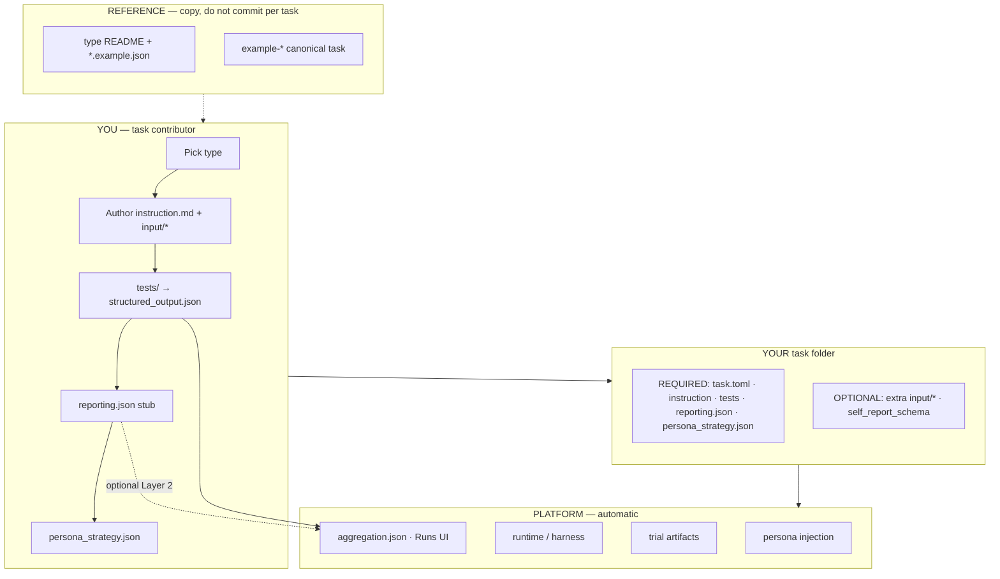
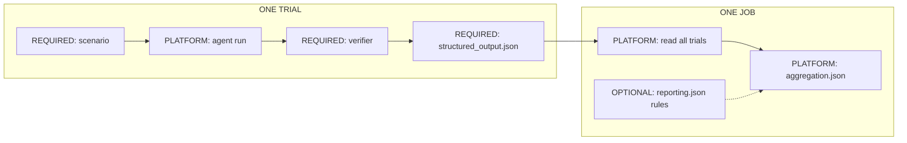

# Application Task Spec

You are designing a **product research scenario**: a simulated persona interacts
with a survey, chatbot, website, or app, and we measure whether the experience
works. This folder is the **contract** that keeps those scenarios consistent,
comparable, and reportable across tasks.

**Start here if you are adding or editing a task under `application/tasks/`.**
Operational copy-paste steps also live in
[`../tasks/README.md`](../tasks/README.md) and [`../task-guide.md`](../task-guide.md);
this document explains *why* the files exist and *how* they connect.

---

## How to read this folder

| Label in diagrams | Meaning | Your action |
|---|---|---|
| **REQUIRED** | Ship without this and the task is incomplete | **You write it** |
| **OPTIONAL** | Richer scenario or debrief | **Add when the study needs it** |
| **PLATFORM** | Runtime, harness, job rollup | **Do not author** |
| **REFERENCE** | Examples, facet contracts | **Copy and lookup** |

| Kind of doc | Examples | You read it to… |
|---|---|---|
| **Onboarding** | this README | Follow the path + see big-picture diagrams below |
| **File layouts** | [authoring-bundle.md](authoring-bundle.md) | Per-type file trees |
| **Type contract** | `survey/`, `chatbot/`, `web/`, `os-app/` README | **Per-type diagram** + metric detail |
| **Cheat sheets** | [structured-output-quick-reference.md](structured-output-quick-reference.md) | Verifier context/facet keys |
| **Deep reference** | [reporting-and-evaluation.md](reporting-and-evaluation.md) | Aggregation internals |
| **Copy-from** | `example-*` tasks, `*.example.json` | Start from working code |

---

## Big picture

One task folder answers four questions:

| Question | Answered by | Consumed when |
|---|---|---|
| What should the persona do? | `instruction.md`, `input/*` | Agent runs the trial |
| Which personas should Playground sample by default? | `persona_strategy.json` | Job / Playground launch |
| Did the run produce valid outputs? | `tests/` verifier | Trial ends |
| What **facts** should batch reports use? | `verifier/structured_output.json` | Job aggregates trials |
| What **extra** cross-trial analysis do we want? | `reporting.json` (optional) | Job aggregates trials |

Personas come from `persona/datasets/` at job launch (`persona_path=`). **Do not**
copy persona YAML into application task folders. Task docs describe the **product
scenario**, not the persona's demographics.

### Ecosystem — who does what



### One trial → one job



**Takeaway:** write the scenario once, emit normalized facts from the verifier,
and let the platform roll up hundreds of personas into one debrief. Per-type
**REQUIRED / OPTIONAL / PLATFORM / REFERENCE** diagrams live in each type README
(Step 1 below).

---

## Contributor onboarding

Follow these steps in order. Each step links to deeper material only when you
need it.

### Step 1 — Pick an interaction type

| Type | Benchmark question | Canonical example | Type contract (includes diagram) |
|---|---|---|---|
| **Survey** | How do personas answer this questionnaire? | `example-survey_product-feedback` | [survey/README.md](survey/README.md) |
| **Chatbot** | Can the chat experience resolve the user's goal? | `chat_recai` | [chatbot/README.md](chatbot/README.md) |
| **Web** | Can the agent use a website correctly? | `example-web-playwright_quote-choice` | [web/README.md](web/README.md) |
| **OS / app** | Can the agent complete native / cross-app work safely? | `example-computer-use-ios_photo-access-review` | [os-app/README.md](os-app/README.md) |

**Unsure between web and OS/app?** If the **website is the product under test**,
choose **web**. If the benchmark is **settings, files, mail, calendar, or
cross-app operating work**, choose **os-app** — even when a browser appears
along the way. Decision guide + shared facet keys:
[shared-core-metrics.md](shared-core-metrics.md).

Copy the closest `example-*` sibling, then rename the folder under
`application/tasks/<your-task-name>/`.

Machine-readable registry of types and drivers: [`manifest.json`](manifest.json).

---

### Step 2 — Author the scenario bundle

Every runnable task includes **`instruction.md`**, **`task.toml`**, **`tests/`**,
and **`reporting.json`**. Supplementary files depend on type:

| Concern | Survey | Chatbot | Web / OS-app |
|---|---|---|---|
| Scenario prose | `instruction.md` | `instruction.md` | `instruction.md` |
| Background / product context | `input/context.md` | `input/context.md` | `input/context.md` (optional) |
| Structured task input | `input/questionnaire.yaml` (includes `askRationale` / `askConfidence`) | `input/chatbot.yaml`, optional `input/protocol.md` | — |
| Objective evidence / harness | platform writes `survey_result.json` + trajectory | platform-managed ([chatbot/eval_artifacts.md](chatbot/eval_artifacts.md)) | prefer trace/state; optional agent submission inline in `instruction.md` |
| Persona self-report | — | `input/self_report_schema.yaml` | `input/self_report_schema.yaml` (optional) |
| Batch policy stub | `reporting.json` | `reporting.json` | `reporting.json` |
| Target cohort / sampling | `persona_strategy.json` | `persona_strategy.json` | `persona_strategy.json` |

Per-type folder trees, `persona_strategy.json` schema, and edge cases:
[authoring-bundle.md](authoring-bundle.md). Harbor metadata (`task.toml`,
timeouts, `[environment].definition`): see [`../task-guide.md`](../task-guide.md).

**Authoring rules that matter early:**

- Keep **persona traits out of** `instruction.md` — the runtime injects persona
  context separately.
- Put the **target cohort** in root `persona_strategy.json` (mode, filters
  and/or `cohortId`, stratify axes, optional `sampleSize`) — not under `input/`.
  Playground applies them under Random / Stratified; operators can turn the task
  default off and edit filters. Schema:
  [authoring-bundle.md § persona_strategy.json](authoring-bundle.md#persona_strategyjson).
- Put **scenario and product background** in `input/context.md` for every task
  type when it helps; keep `instruction.md` focused on goals, steps, and schemas.
- Keep **operator setup** (agent names, smoke commands) in the task's own
  `README.md`, not in `instruction.md`.
- Reuse **`environment/task-environments/application/shared-*`** runtimes when
  possible; add a task-specific environment only for a genuinely new sidecar or
  browser stack.
- Do **not** add `environment/` inside a survey task folder — it shadows the
  shared survey runtime.

---

### Step 3 — Verifier: emit facts, not prose

After each trial, your verifier (`tests/`) should write
**`verifier/structured_output.json`**: normalized **contexts** (typed slices
like `task_outcome`, `question_response`) each holding **facets** (small named
fields like `outcome_status`, `response`, `feedback_reason`).

```text
structured_output.json
  contexts[]
    key: "task_outcome.primary"
    contextType: "task_outcome"      ← reporting.json matches on this
    facets[]
      key: "outcome_status"
      kind: numerical | categorical | textual
      value: ...
```

**Extension rule:** reuse shared `contextType` and facet names from the type
contract. Add task-specific detail in new contexts or `task_*` fields — do not
rename shared keys to fit one scenario.

| Type | Minimum contexts to plan for |
|---|---|
| Survey | `question_response` (per question), `trial_summary` |
| Chatbot | `task_outcome`, `conversation_summary`, `user_feedback` when self-report exists |
| Web | shared core ([shared-core-metrics.md](shared-core-metrics.md)) + `decision` / `decision_process` for browse/choose tasks |
| OS / app | shared core + scenario-specific artifact or handoff contexts |

Context/facet cheat sheet and JSON templates:
[structured-output-quick-reference.md](structured-output-quick-reference.md).

---

### Step 4 — Batch reporting: two layers

When many trials finish as one job, the platform builds **`aggregation.json`**
for the Runs debrief. Two layers stack:

| Layer | Your config | What happens |
|---|---|---|
| **Layer 1 — automatic** | Valid `structured_output.json` only | Platform stats every facet: numerical averages, categorical counts, text samples |
| **Layer 2 — optional** | Rules in `reporting.json` | Bucketed LLM summaries and judge scans on top of Layer 1 |

**Minimum viable `reporting.json`:**

```json
{ "schemaVersion": "1.0", "contextRules": [] }
```

Layer 1 still runs. Add `contextRules[]` when you want semantic summaries (for
example "summarize `reason` grouped by `response`" on survey questions).

End-to-end flow, Layer 1 internals, Layer 2 directives, and template index:
[reporting-and-evaluation.md](reporting-and-evaluation.md).

**Do not** hide reporting policy inside verifier code. The verifier writes
**facts**; `reporting.json` declares **optional extra analysis**.

---

### Step 5 — Smoke, batch, debrief

1. **Smoke one persona** — [`../QUICKSTART.md`](../QUICKSTART.md)
2. **Launch a batch job** — [`../tasks/README.md`](../tasks/README.md),
   [`../scripts/README.md`](../scripts/README.md)
3. **Review aggregation** — Playground **Runs** UI or `report_job.py`

Iterate on `instruction.md` / verifier until smoke passes, then scale personas.

---

## What you own vs what the platform owns

| Layer | Location | Written by | Purpose |
|---|---|---|---|
| **Scenario** | `instruction.md`, `input/*` | Contributor | What the persona should do |
| **Target cohort / sampling** | `persona_strategy.json` | Contributor | Playground cohort filters / mode / sample size |
| **Harness artifacts** | transcript, traces, application results | Platform runtime | Raw interaction record |
| **Verifier output** | `verifier/structured_output.json` | Contributor (`tests/`) | Normalized evaluation facts for one trial |
| **Batch policy** | `reporting.json` | Contributor | Optional Layer 2 aggregation rules |
| **Job summary** | `aggregation.json` | Platform | Cross-trial stats + optional LLM units |
| **Persona profile** | `persona/datasets/*` | Persona team | Who the simulated user is |

---

## Interactive tasks: subjective feedback

For **chatbot**, **web**, and **os-app** tasks that collect post-run persona
ratings:

1. Define prompts in `input/self_report_schema.yaml`
2. Runtime writes `user_feedback.json`
3. Verifier maps into a `user_feedback` **context** in `structured_output.json`

Shared facet names (`overall_experience_rating`, `trust_level`, …) live in
[shared-core-metrics.md § Shared subjective channel](shared-core-metrics.md#shared-subjective-channel-interactive-tasks).
Family-specific slices (`experience` on web, conversation-only chatbot fields)
**add on top** — they do not replace `user_feedback`.

---

## Runtime boundary

The persona agent only sees the **protocol surface** for the task type (survey
instrument, chat loop, browser/computer-use API, OS surface). Internal APIs,
databases, and health checks belong to setup, reset, and verifier logic — not
the agent's reachable interface. Full statement:
[runtime-boundary.md](runtime-boundary.md).

---

## Go deeper (by topic)

Use this when a step above is not enough — not as a flat reading list.

**Authoring & folder layout**

- [authoring-bundle.md](authoring-bundle.md) — per-type file trees + `persona_strategy.json`
- [survey/README.md](survey/README.md) — `questionnaire.yaml` contract
- [chatbot/README.md](chatbot/README.md) — chat loop + reporting contexts
- [chatbot/eval_artifacts.md](chatbot/eval_artifacts.md) — platform-managed chat artifacts
- [web/README.md](web/README.md) — browser metrics + persona-sensitive browse tasks
- [os-app/README.md](os-app/README.md) — outcome-based OS benchmarks

**Evaluation & metrics**

- [structured-output-quick-reference.md](structured-output-quick-reference.md) — contexts, facets, example JSON paths
- [shared-core-metrics.md](shared-core-metrics.md) — web/os shared core + subjective channel
- `shared_core_metric_contract.example.json` — machine-readable shared core

**Reporting & jobs**

- [reporting-and-evaluation.md](reporting-and-evaluation.md) — Layer 1/2, mermaid flows, `contextRules`
- [`../tasks/README.md`](../tasks/README.md) — reporting policy examples, operational notes

**Repo layout & operations**

- [`../task-guide.md`](../task-guide.md) — `task.toml`, environments, verifier layout
- [`../QUICKSTART.md`](../QUICKSTART.md) — first end-to-end run
- [`../choosing-an-agent.md`](../choosing-an-agent.md) — agent + API keys

---

## Before you open a PR

- [ ] Copied the canonical example for your interaction type
- [ ] `instruction.md` describes the scenario, not persona demographics
- [ ] `task.toml` `[metadata].type` matches the contract folder you followed
- [ ] Verifier emits `structured_output.json` with shared context names where applicable
- [ ] `reporting.json` exists (empty `contextRules` is fine)
- [ ] `persona_strategy.json` at task root with a target cohort (`dimensionFilters` and/or `cohortId`; see [authoring-bundle.md](authoring-bundle.md#persona_strategyjson))
- [ ] If strategy filters are narrower than `bench-dev-sample` coverage, prefer `generate_dev_personas.py --strategy …` first (Playground auto top-up is a fallback; synthetic pools exist because the production persona dataset is not ready yet — use them to validate task design + persona reporting, see [authoring-bundle.md](authoring-bundle.md#ensuring-pool-coverage))
- [ ] Interactive tasks: `self_report_schema.yaml` → `user_feedback` context when used
- [ ] Smoke run passes on at least one persona before batch scale-up
- [ ] Multi-persona batch validation: attach the **Playground UI** batch PDF
      (Runs → job → **Download PDF** on the persona-task batch report). That
      client-facing export is the required PR artifact. Do **not** substitute
      the server text report from `GET …/report.pdf` or a hand-built PDF — those
      do not match the UI report reviewers expect.

---

## This directory at a glance

```text
task-spec/
├── README.md                          ← you are here (diagrams + onboarding)
├── manifest.json
├── authoring-bundle.md                ← per-type file layouts
├── reporting-and-evaluation.md        ← batch aggregation deep dive
├── structured-output-quick-reference.md
├── shared-core-metrics.md             ← web + os-app shared contracts
├── runtime-boundary.md
├── survey/   chatbot/   web/   os-app/   ← type contracts + example JSON
└── shared_core_metric_contract.example.json
```
