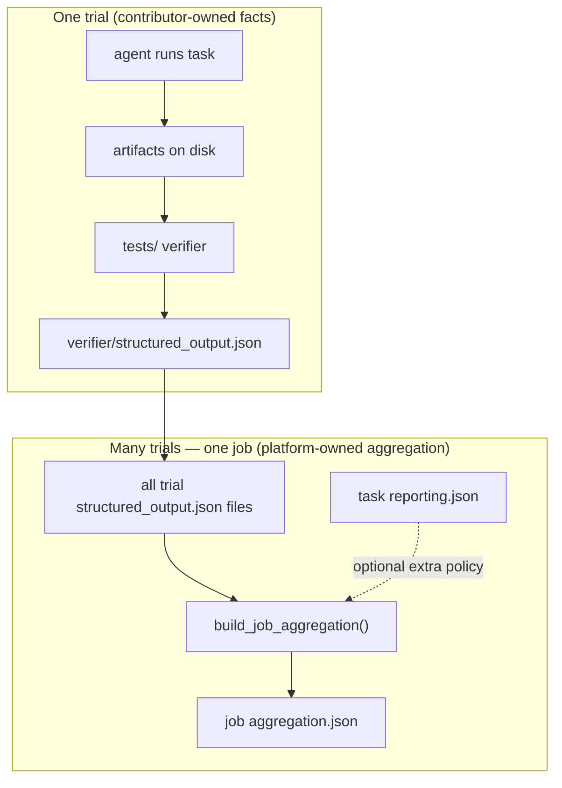
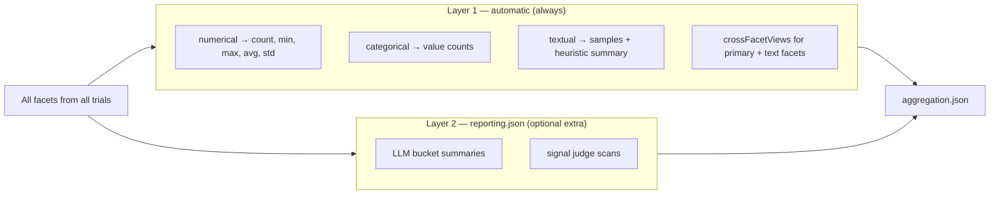
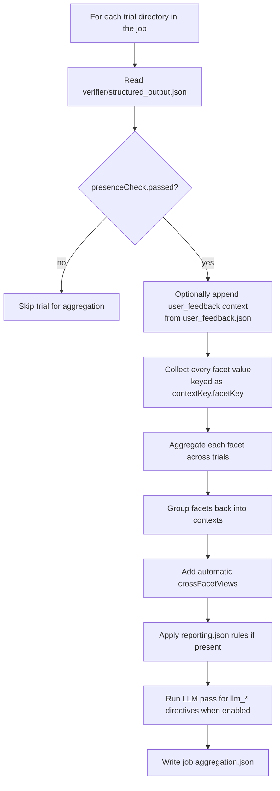

# Reporting and evaluation

Batch reporting turns many persona trials into one job-level summary (Playground
**Runs**, job `aggregation.json`). See [README.md](README.md) **Step 4** for the
onboarding summary; this document is the full reference.

As a task contributor you own the **facts**
and the **aggregation policy**; the platform owns job execution and UI.

### End-to-end flow



Read the diagram in two parts:

1. **Top — one trial:** the verifier turns runtime artifacts into normalized
   `contexts[]` + `facets[]`. That is the only file the verifier must write.
2. **Bottom — one job:** the platform reads **every** trial's
   `structured_output.json`, optionally reads `reporting.json`, and writes one
   `aggregation.json`.

`reporting.json` is **not** required for aggregation to happen. An empty file
works:

```json
{ "schemaVersion": "1.0", "contextRules": [] }
```

### Two aggregation layers

When a job finishes, the platform always builds `aggregation.json` in **two
layers**:



| Layer | Needs `reporting.json`? | What you get | Example |
|---|---|---|---|
| **Layer 1 — automatic** | No | Basic stats for every facet the verifier emitted | `outcome_status` counts, `overall_experience_rating` avg, `reason` samples |
| **Layer 2 — extra policy** | Yes (`contextRules[]`) | Cross-trial text analysis configured by the task | summarize `reason` by `response`; judge price-sensitivity signals |

Layer 1 runs whenever verifier output exists. Layer 2 only adds
`summaries[]` / `judges[]` when matching `summaryDirectives` or
`judgeDirectives` are present. LLM-backed directives also need
`PERSONAEVAL_REPORTING_ENABLE_LLM=1`.

Contributor minimum:

- **must do:** emit valid `structured_output.json` → Layer 1 appears automatically
- **optional:** fill `reporting.json` when you want Layer 2 LLM analysis

### How Layer 1 automatic aggregation works

Implementation: `application/persona_eval/backend/service/job_aggregation.py`
(`build_job_aggregation()`).

When it runs:

- after trials finish and the job view is built in Playground
- when a reporting refresh is triggered for a completed job
- when you run `application/scripts/report_job.py` manually

You do not call this yourself as a task contributor. If verifier output exists for
completed trials, the platform builds or refreshes `aggregation.json`.



Step by step:

1. **Collect trial facts**
   - Walk every trial folder under the job directory.
   - Read `verifier/structured_output.json` when `presenceCheck.passed` is true.
   - If the trial has `user_feedback.json` but no `user_feedback` context yet,
     the platform synthesizes that context from `self_report_schema.yaml`.

2. **Flatten facets across trials**
   - Every facet becomes one cross-trial field keyed as
     `contextKey.facetKey`, for example `question.q1.response` or
     `task_outcome.primary.outcome_status`.
   - Each trial contributes `{ trialName, personaId, value }` for that field.

3. **Aggregate by `kind` (always, for every facet)**
   - `numerical` → `count`, `min`, `max`, `avg`, `std`
   - `categorical` → ranked `counts[]` plus `distinctCount`
   - `textual` → `count`, `uniqueCount`, up to 5 `samples`, and a short
     heuristic `summary` string
   - Every aggregated field also records `presentCount` and `missingCount`
     across artifact-ready trials.

4. **Rebuild contexts**
   - Facets that belonged to the same trial context are grouped back together
     under that context in `aggregation.json` → `contexts[]`.

5. **Automatic crossFacetViews (still Layer 1)**
   - If a context has a `primary` categorical facet plus textual facets with
     role `explanation`, `evidence`, or `supporting_text`, the platform also
     emits `crossFacetViews[]` of type `text_by_primary_category`.
   - This is a **non-LLM** preview: text samples grouped by the primary
     category, for example outcome reasons grouped by `outcome_status`.

6. **Write `aggregation.json`**
   - Top-level output includes:
     - `coverage` — trial counts and artifact readiness
     - `fields[]` — flat cross-trial view of every facet
     - `contexts[]` — grouped view with facets, optional crossFacetViews, and
       optional Layer 2 units

Example of automatic output shape (Layer 1 only):

```json
{
  "coverage": { "trialCount": 100, "artifactReadyTrials": 98 },
  "fields": [
    {
      "key": "question.q1.response",
      "kind": "numerical",
      "presentCount": 98,
      "numerical": { "count": 98, "min": 1, "max": 5, "avg": 3.8, "std": 0.9 }
    }
  ],
  "contexts": [
    {
      "key": "question.q1",
      "contextType": "question_response",
      "facets": [ "...same aggregated facet payloads..." ],
      "crossFacetViews": [ "...optional text_by_primary_category..." ]
    }
  ]
}
```

### How Layer 2 extra aggregation works

Layer 2 starts only when `reporting.json` contains matching `contextRules[]`
(or when equivalent directives are embedded in a context).

For each matched context, the platform:

1. Reads `summaryDirectives` and/or `judgeDirectives`.
2. Groups trials into **buckets** using `groupByFacetKey` + `groupByMode`
   (`categorical`, `numeric_band`, or `none`).
3. Builds bucket payloads with counts and text samples.
4. For `summaryKind: "llm_bucket_summary"` or `judgeKind: "llm_signal_judge"`:
   - marks units as `ready_for_llm`
   - runs the LLM in the background when `PERSONAEVAL_REPORTING_ENABLE_LLM=1`
   - caches results back into `aggregation.json` by fingerprint

Even before LLM runs, Layer 2 still creates the bucket structure and heuristic
text previews. LLM replaces those previews with semantic summaries or signal
judgments.

| Stage | Needs LLM? | Appears in `aggregation.json` as |
|---|---|---|
| Layer 1 facet stats | No | `fields[]`, `contexts[].facets[]` |
| Layer 1 crossFacetViews | No | `contexts[].crossFacetViews[]` |
| Layer 2 bucket skeleton | No | `contexts[].summaries[]` / `judges[]` with heuristic status |
| Layer 2 LLM completion | Yes | same units with `status: "llm_completed"` |

### Three layers — who owns what

| Layer | File | Written by | What it contains |
|---|---|---|---|
| **Authoring** | `instruction.md`, `input/*`, `self_report_schema.yaml` | Task contributor | Scenario, schemas, self-report questions |
| **Verifier output** | `verifier/structured_output.json` | Task verifier (`tests/`) | Normalized **contexts** and **facets** for one trial |
| **Batch reporting policy** | `reporting.json` | Task contributor | **Optional** rules for extra LLM summaries and judges |
| **Job output** | `aggregation.json` | Platform | Layer 1 automatic stats **plus** optional Layer 2 summaries/judges |

Keep these separate:

- The **verifier** reads trial artifacts and writes **facts**
  (`structured_output.json`). That alone is enough for automatic aggregation.
- **`reporting.json`** declares **extra** cross-trial analysis on top of Layer 1.
  Do not hide reporting policy inside verifier code.

### Contributor checklist

For every task:

1. **`tests/`** — validate outputs and emit `structured_output.json` with shared
   context names where possible (`task_outcome`, `user_feedback`, …).
2. **`reporting.json`** — at minimum `{ "schemaVersion": "1.0", "contextRules": [] }`;
   add rules when you want bucketed LLM summaries or judge scans.
3. **Interactive tasks only** — optional `input/self_report_schema.yaml` for
   post-run persona questions → `user_feedback.json` → `user_feedback` context.

### `structured_output.json` (verifier)

Each trial's verifier should extract **contexts**: typed slices of evaluation
(for example `task_outcome`, `conversation_summary`, `user_feedback`). Each
context holds **facets**: small named fields (`outcome_status`, `feedback_reason`,
…).

Use the shared context and facet names from the type-specific README when you
can. That keeps batch reports comparable across tasks of the same family.

### `reporting.json` (optional extra batch policy)

`reporting.json` is **optional beyond an empty stub**. Without it, Layer 1
automatic aggregation still runs. Add rules when you want Layer 2 analysis.

`reporting.json` lists **context rules**. Each rule:

- **matches** trials that emitted a given `contextType`
- **summaryDirectives** — group trials by one facet and summarize another (often
  with `summaryKind: "llm_bucket_summary"`)
- **judgeDirectives** (optional) — scan text facets for configured signals

Minimal starter:

```json
{
  "schemaVersion": "1.0",
  "contextRules": []
}
```

Example rule (summarize `outcome_reason` grouped by `outcome_status`):

```json
{
  "match": { "contextType": "task_outcome" },
  "summaryDirectives": [
    {
      "id": "task_outcome.reason_by_status",
      "title": "Outcome reason by status",
      "targetFacetKey": "outcome_reason",
      "groupByFacetKey": "outcome_status",
      "groupByMode": "categorical",
      "summaryKind": "llm_bucket_summary"
    }
  ]
}
```

Copy from the canonical task for your type, or from the example JSON templates
in the type folder (see table below).

When PersonaEval runs with `PERSONAEVAL_REPORTING_ENABLE_LLM=1`, `llm_*`
directives run in the background and results are cached in the job's
`aggregation.json`. See [`../tasks/README.md`](../tasks/README.md) for UI and
operational notes.

### Type-specific reporting guides

Reporting templates are split into **layers** you can combine in one task
`reporting.json`. Most product studies care about both **execution** (did the
run succeed, what broke) and **persona variation** (did choices or experience
differ by persona).

| Type | Execution layer | Persona layer | Notes |
|---|---|---|---|
| Survey | per-question contexts from verifier | usually N/A | [`survey/survey_reporting.example.json`](survey/survey_reporting.example.json) |
| Chatbot | [`chatbot_reporting.example.json`](chatbot/chatbot_reporting.example.json) | same file | chatbot baseline already covers outcome + conversation + feedback |
| Web | [`web_metric_reporting.example.json`](web/web_metric_reporting.example.json) | [`web/persona_sensitive_reporting.example.json`](web/persona_sensitive_reporting.example.json) | merge `contextRules[]` when you need both |
| OS / app | [`os_app_metric_reporting.example.json`](os-app/os_app_metric_reporting.example.json) | [`os_app_persona_reporting.example.json`](os-app/os_app_persona_reporting.example.json) | merge `contextRules[]` when you need both |

Structured-output examples follow the same split where applicable:

- Survey: `survey/survey_structured_output.example.json`
- Chatbot: `chatbot/chatbot_structured_output.example.json`
- Web: `web/web_metric_structured_output.example.json`, `web/persona_sensitive_structured_output.example.json`
- OS / app: `os-app/os_app_metric_structured_output.example.json`, `os-app/os_app_persona_structured_output.example.json`

Survey tasks usually summarize per-question responses from survey answer
contexts. Start from
[`survey/survey_reporting.example.json`](survey/survey_reporting.example.json) or
[`example-survey_product-feedback/reporting.json`](../tasks/example-survey_product-feedback/reporting.json).
Type READMEs define required facets and recommended patterns for each layer.

### Authoring vs reporting (quick reminder)

| Concern | Where it lives |
|---|---|
| What the persona should do | `instruction.md`, `input/*` |
| What one trial produced | trial artifacts + `structured_output.json` |
| Automatic batch stats (Layer 1) | platform `aggregation.json` — no config needed |
| Extra LLM summaries / judges (Layer 2) | `reporting.json` |
| Platform harness artifacts (chatbot) | [`chatbot/eval_artifacts.md`](chatbot/eval_artifacts.md) |

Do not embed batch reporting policy in verifier code. Keep transport details and
API tables in `input/protocol.md` (chatbot) rather than in `instruction.md`.

