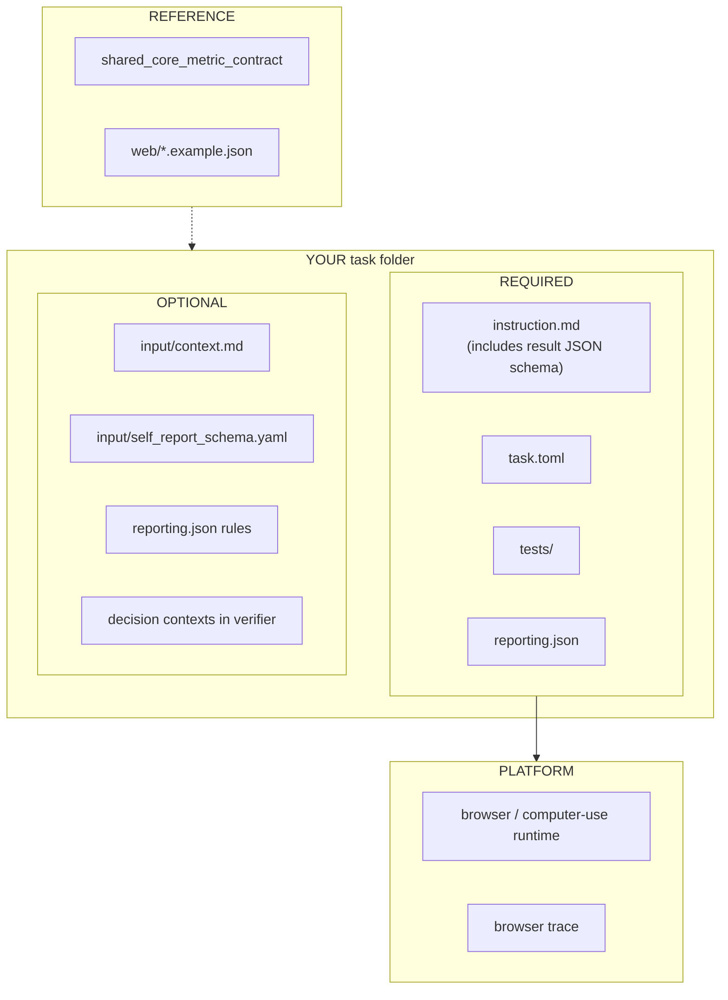

# Web / Browser Application Tasks

This folder defines the shared contract for browser-mediated application tasks.
These tasks may run in a traditional browser runtime or a computer-use runtime,
but the benchmark target is still a web experience.

**Canonical copy-from:** `application/tasks/example-web-playwright_quote-choice`

### What you author (required vs optional)

Web verifiers use **two layers**: shared core ([shared-core-metrics.md](../shared-core-metrics.md))
plus web-specific contexts (`decision`, `decision_process`, `web_interaction`, …).
**No** `input/output_schema.md` — put the submission JSON schema in `instruction.md`.

| Context | Priority |
|---|---|
| `task_outcome` | **Required** |
| `decision` + `decision_process` | **Required** for browse/choose tasks |
| `goal_component`, `side_effects`, `user_feedback` | Strongly recommended |
| `web_interaction`, `experience` | Optional depth |

## Contract

- Task instruction: define the user goal, submission steps, and result JSON schema
  in `instruction.md`. Put long scenario or product background in
  `input/context.md` (same convention as survey and chatbot tasks).
- Interaction protocol: browser or computer-use actions, ending with an explicit done action.
- Runtime environment: a shared or dedicated browser/computer-use stack, plus a
  hosted web application sidecar when the task needs one.
- Stop conditions: max steps, explicit done action, verifier timeout, or task failure.
- Artifacts: browser trajectory, final application result JSON, objective
  result, and persona self-report.
- Evaluation contract: schema validation, optional application-state verifier,
  and persona self-report.

## Web Metric Contract

`web/` and `os-app/` should both exist.

- `web/` is for browser-mediated tasks, including search, browse, compare,
  form-fill, cart/checkout, account flows, and other website interactions.
- `os-app/` is for native desktop/mobile app tasks and cross-app operating
  workflows.

They should share a common evaluation philosophy, but they should not collapse
into one contract because the failure modes and reporting slices differ.

### Shared Core

Web tasks should still reuse the same core benchmark contexts as `os-app/`:

- `task_outcome`
- `goal_component`
- `user_feedback` when the task collects post-run self-report
- `side_effects`
- `execution_profile`
- `infeasibility`
- `persona_alignment` / `persona_constraint` when persona is part of the target

So the two folders are aligned, not identical.

Use [`../shared-core-metrics.md`](../shared-core-metrics.md) as the source of truth for the shared core context names,
facet keys, and reuse rules. See
`../shared_core_metric_contract.example.json` for the machine-readable
companion.

### Web-Specific Additions

Web tasks should additionally capture web-only interaction signals:

1. `web_interaction`
   Required when browsing behavior matters. Captures how the agent navigated the
   site.
2. `web_artifact`
   Recommended when a task asks for a submitted answer, selected item, or other
   browser-visible result.
3. `decision` / `decision_process`
   Recommended for persona-sensitive browse-and-choose tasks.
4. `experience`
   Optional. Use only when a task needs a separate web-specific slice for UI
   friction or journey analysis. Do not use it as a replacement for shared
   `user_feedback`.

### Shared Subjective Feedback

When a web task asks for post-run persona self-report:

- write the raw artifact to `user_feedback.json`
- define task-owned questions in `input/self_report_schema.yaml`
- map the result into the shared `user_feedback` context

Use the shared `user_feedback` context as the default home for subjective
signals such as satisfaction, trust, effort, and clarity. Add `experience`
only when a separate web-specific slice materially improves analysis.

### Recommended Web Metrics

Keep `task_success_rate` as the main external metric. Useful web-specific
diagnostics include:

- `form_completion_rate`
- `submission_correct_rate`
- `search_or_filter_usage_rate`
- `wrong_page_terminal_rate`
- `live_dependency_failure_rate`

### Recommended Facets For `web_interaction`

| Facet key | Role | Kind | Notes |
|---|---|---|---|
| `navigation_path_type` | `primary` | `categorical` | Shared web path bucket |
| `page_count_visited` | `score` | `numerical` | Distinct pages or major views |
| `used_search` | `evidence` | `categorical` | Encode as `true` / `false` |
| `used_filter_or_sort` | `evidence` | `categorical` | Encode as `true` / `false` |
| `used_backtracking` | `evidence` | `categorical` | Encode as `true` / `false` |
| `web_interaction_notes` | `explanation` | `textual` | Free-text journey summary |

### Recommended Facets For `web_artifact`

| Facet key | Role | Kind | Notes |
|---|---|---|---|
| `artifact_type` | `primary` | `categorical` | What result was produced |
| `artifact_status` | `primary` | `categorical` | Shared correctness bucket |
| `artifact_subject_label` | `evidence` | `categorical` | Human-readable selected/submitted item (exact-count identity) |
| `artifact_subject_id` | `evidence` | `categorical` | Stable id when available |
| `artifact_evidence` | `explanation` | `textual` | Concrete correctness rationale |

### Shared Enumerations

`navigation_path_type`

- `direct`
- `search_driven`
- `browse_driven`
- `compare_then_commit`
- `looping`
- `other`

`artifact_type`

- `submission`
- `selection`
- `cart_state`
- `reservation`
- `message`
- `download`
- `other`

`artifact_status`

- `correct`
- `partially_correct`
- `incorrect`
- `not_produced`

### Default reporting pattern (execution layer)

For web tasks, start with the **execution layer** in `reporting.json`:

- summarize `outcome_explanation` by `outcome_status`
- summarize `web_interaction_notes` by `navigation_path_type`
- summarize `artifact_evidence` by `artifact_status`
- optionally judge `outcome_explanation` or `web_interaction_notes` for
  recurring web failure signals such as navigation failure, search misuse,
  form misunderstanding, or live-site brittleness

Templates:

- `web_metric_structured_output.example.json`
- `web_metric_reporting.example.json`

## Persona reporting layer

When reviewers also care about **how different personas choose different
outcomes or rate the experience**, add the **persona layer** on top of the
execution layer. Merge the `contextRules[]` from both templates into one task
`reporting.json` when you need both.

The persona layer should help batch reporting answer:

- what the persona chose
- why they chose it
- which decision axis mattered most
- how they explored before deciding

Keep using the platform's existing artifact shape:

- verifier writes `verifier/structured_output.json`
- task root defines `reporting.json`
- both continue to use `contexts[]`, `facets[]`, `summaryDirectives[]`, and
  `judgeDirectives[]`

This contract adds **standard context types, facet keys, and small shared
enumerations** so contributors can extend task-specific details without
breaking cross-task reporting.

### Minimum Contexts

Persona-sensitive web tasks should emit these contexts when applicable:

1. `task_outcome`
   Reuse the shared task-level outcome contract.
2. `decision`
   The persona's main selection or terminal choice. This is the core additional
   persona-sensitive context for browse-and-choose tasks.
3. `decision_process`
   How the persona explored before deciding. Recommended for browse/compare
   tasks.
4. `user_feedback`
   Shared post-run subjective feedback. Recommended whenever the task collects
   self-report.
5. `experience`
   Optional web-specific subjective slice for friction or UI analysis.

If a task cannot produce a stable `decision` context, it is probably not a
strong persona-sensitive benchmark example.

Shared runtime examples in this repo live under:

- `environment/task-environments/application/shared-web-playwright`
- `environment/task-environments/application/shared-web-browser-use`
- `environment/task-environments/application/shared-web-cocoa`
- `environment/task-environments/application/shared-web-cua-linux`

### Required Facets For `decision`

The `decision` context should contain these standard facets:

| Facet key | Role | Kind | Required | Notes |
|---|---|---|---|---|
| `decision_outcome` | `primary` | `categorical` | Yes | Standard result bucket |
| `basis_primary` | `primary` | `categorical` | Yes | Main reason axis |
| `reason` | `explanation` | `textual` | Yes | Persona's free-text explanation |
| `decision_subject_label` | `evidence` | `categorical` | Yes | Human-readable choice label (exact-count identity, not free-text) |
| `decision_subject_id` | `evidence` | `categorical` | Prefer | Stable id when available |

Recommended extra facets:

- `basis_secondary` (`categorical`)
- `decision_confidence` (`numerical`)
- `price_bucket` (`categorical`)
- `risk_posture` (`categorical`)
- `task_*` extension facets for task-specific details

### Recommended Facets For `decision_process`

Use a `decision_process` context when the persona actually browses or compares:

| Facet key | Role | Kind | Notes |
|---|---|---|---|
| `exploration_style` | `primary` | `categorical` | Shared process bucket |
| `options_considered_count` | `score` | `numerical` | Count of distinct options looked at |
| `used_search` | `evidence` | `categorical` | Encode as `true` / `false` |
| `used_filter_or_sort` | `evidence` | `categorical` | Encode as `true` / `false` |
| `comparison_notes` | `explanation` | `textual` | Optional free-text process summary |

### Recommended Facets For `user_feedback`

If the task asks for ratings or self-report after browsing, keep the default
subjective channel in a separate `user_feedback` context:

| Facet key | Role | Kind |
|---|---|---|
| `overall_experience_rating` | `score` | `numerical` |
| `feedback_reason` | `explanation` | `textual` |
| `need_constraint_satisfaction` | `evidence` | `categorical` |
| `personal_preference_satisfaction` | `evidence` | `categorical` |
| `trust_level` | `score` | `numerical` |
| `effort_rating` | `score` | `numerical` |
| `clarity_of_next_step` | `evidence` | `categorical` |

### Optional Facets For `experience`

Only add an `experience` context when a web task benefits from a narrower
journey-specific or UI-specific slice beyond shared `user_feedback`:

| Facet key | Role | Kind |
|---|---|---|
| `need_satisfaction` | `score` | `numerical` |
| `ease_of_use` | `score` | `numerical` |
| `trust_level` | `score` | `numerical` |
| `overall_experience_rating` | `score` | `numerical` |
| `friction_primary` | `primary` | `categorical` |

### Shared Enumerations

Contributors should reuse these enums where possible instead of inventing
near-duplicates.

`decision_outcome`

- `selected`
- `considered`
- `rejected`
- `deferred`
- `skipped`

`basis_primary` / `basis_secondary`

- `price`
- `quality`
- `features`
- `convenience`
- `taste`
- `trust`
- `familiarity`
- `novelty`
- `fit`
- `other`

`exploration_style`

- `quick_pick`
- `compared_multiple`
- `deep_research`
- `hesitant`

`friction_primary`

- `price_confusion`
- `navigation`
- `information_gap`
- `choice_overload`
- `trust_concern`
- `none`
- `other`

`need_constraint_satisfaction` / `personal_preference_satisfaction`

- `yes`
- `partially`
- `no`

### Contributor Extension Rules

- Keep the standard facet keys exactly as written above.
- Put task-specific additions behind a `task_` prefix, for example
  `task_selected_color` or `task_plan_term`.
- Prefer a small shared enum plus `other` instead of inventing new near-synonym
  categories for every task.
- Keep `reason` as raw natural language from the persona's perspective.
- Do not bake reporting policy into the verifier; use `reporting.json` for
  summaries and judges.

### Persona layer reporting pattern

When the persona layer applies, extend `reporting.json` with rules that usually:

- summarize `feedback_reason` by `need_constraint_satisfaction` when shared
  feedback exists
- summarize `reason` by `decision_outcome`
- summarize `reason` by `basis_primary`
- optionally judge `reason` for reusable signals like price / quality /
  convenience / trust / novelty

Persona layer templates:

- `persona_sensitive_structured_output.example.json`
- `persona_sensitive_reporting.example.json`

Combine with the execution layer templates listed above when a study needs both.

For native app and cross-app operating templates, see `../os-app/`.

## Canonical Task

`application/tasks/example-web-playwright_quote-choice`

The quote-choice web task is intentionally small and public so it validates the
task-specific host pattern before introducing heavier web application services.
