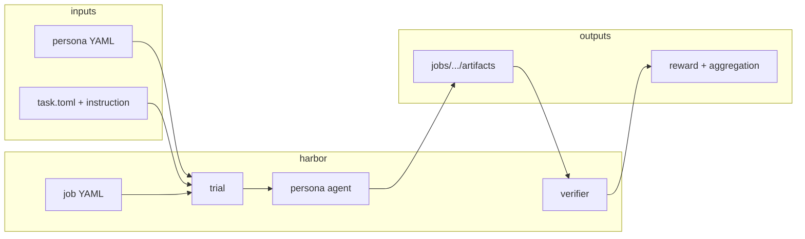

# Environment module

> Part of [Playground](../README.md). This module owns **how simulations run**:
> Harbor jobs, trial execution, persona agents, shared task environments, and
> optional remote workers.

If you are new to the repo, read this page first to understand how
`persona/`, `application/`, and `environment/` connect at runtime.

---

## Mental model

Playground separates **what to simulate** from **how to execute it**:

```text
  persona/datasets/          application/tasks/           environment/
  (YAML profiles)            (scenario + verifier)        (runtime + agents)
        │                            │                            │
        └──────── persona_path ──────┴──── task path ─────────────┘
                                     │
                              Harbor job YAML
                                     │
                         trial → agent → artifacts
                                     │
                              jobs/<job_name>/
```

| Layer | Path | Responsibility |
|-------|------|------------------|
| Persona input | `persona/datasets/bench-dev-sample/` | *Who* the simulated user is |
| Task definition | `application/tasks/<name>/` | *What* they do (`instruction.md`, verifier, `reporting.json`) |
| Task environment | `environment/task-environments/application/` | Docker images, sidecars, browser stacks |
| Runtime | `environment/runtime/harbor/` | Job/trial loop, backends (host, docker, use-computer, …) |
| Agents | `environment/agents/matraix/agents/` | `persona-claude-code`, `persona-browser-use`, `persona-computer-1`, … |
| Job recipes | `configs/jobs/` | Multi-trial batches, concurrency, agent/model defaults |
| Outputs | `jobs/` | Per-trial artifacts, verifier results, optional aggregation |

Applications define scenarios. Environment executes them. Persona data is
**referenced** (`persona_path=…`), never copied into task folders.

---

## Execution surfaces

Three ways to launch the same Harbor contract:

| Surface | When to use | Entry |
|---------|-------------|-------|
| **Harbor CLI** | Scripts, CI, debugging | `uv run harbor run -c configs/jobs/…` |
| **Playground** | Interactive task play, persona sampling | [application/QUICKSTART.md §10](../application/QUICKSTART.md#10-playground--play-tasks-visually) |
| **Playground API** | Automation, external tools | `POST /api/harbor/jobs` — [REST_API.md](../application/playground/REST_API.md) |

All paths share:

- the same task folders under `application/tasks/`
- the same artifact layout under `jobs/<job_name>/`
- the same agent and backend resolution rules

### Execution planes

| Plane | Meaning | Configure |
|-------|---------|-----------|
| `harbor` (default) | API or laptop runs `harbor run` locally | `MATRIX_EXECUTION_PLANE=harbor` |
| `remote` | API dispatches to a Remote Runner worker over HTTP | `MATRIX_EXECUTION_PLANE=remote` + `REMOTE_RUNNER_API_URL` |

Remote plane details: [UNIFIED_RUNTIME.md](../application/playground/UNIFIED_RUNTIME.md).

**Security note:** the remote plane sends only `PYTHONPATH` and `MATRIX_*` task
exports over HTTP. API keys must live on the **worker**, not in the dispatch
payload.

---

## Directory map

```text
environment/
  README.md                 ← you are here
  adapters/                 Optional external benchmark adapters (manifest-backed)
  agents/matraix/      Persona-conditioned agent implementations
  runtime/harbor/           Harbor CLI, trial loop, models, verifier, viewer backend
  task-environments/
    application/            Persona shared-* + SUT *-sidecar_* (shared-chat-persona, chatbot-api-sidecar_*, chatbot-mcp-sidecar_*, web-sidecar_*, shared-web-*, shared-os-app-*, …)

configs/jobs/
  example-job-recipe/       Smoke + small local demos
  application-task-job-recipe/  Generated multi-persona application jobs

packages/
  playground/             Playground Python package (remote runner, harbor helpers)
  rewardkit/                Verifier / LLM-judge toolkit

apps/viewer/                Frontend paired with `harbor view`
```

Python import names stay stable: `harbor.*`, `matraix.agents.*`, `playground.*`.

---

## Environment variables

### Execution plane

| Variable | Purpose |
|----------|---------|
| `MATRIX_EXECUTION_PLANE` | `harbor` (default) or `remote` |
| `REMOTE_RUNNER_API_URL` | Remote runner base URL (required for `remote`) |
| `REMOTE_RUNNER_API_KEY` | Optional bearer token for the worker API |
| `REMOTE_RUNNER_HARBOR_COMMAND` | Override `harbor` CLI on the worker |
| `REMOTE_RUNNER_INLINE` | Dev/tests: run jobs inline in the API process |

### Task exports (local + remote worker)

Set before `harbor run`, or let `generate_application_job.py` print them:

| Variable | When |
|----------|------|
| `MATRIX_SURVEY_TASK_PATH` | Survey / json-survey trials |
| `MATRIX_CHATBOT_TASK_PATH` | Chatbot / user-sim trials |
| `MATRIX_CHATBOT_DOMAIN` | Recommender domain (legacy compat) |
| `MATRIX_CHATBOT_APPLICATION_ID` | Chat sidecar application id |
| `MATRIX_CHATBOT_APPLICATION_CONTEXT` | Chat sidecar context |
| `MATRIX_CHATBOT_MAX_TURNS` | User-sim turn cap |

### Model credentials (local process / worker)

Not sent over the remote plane. Per-agent names:

| Agents | Typical keys |
|--------|----------------|
| `persona-claude-code`, `persona-json-survey`, browser/CUA personas | `ANTHROPIC_API_KEY` |
| User-sim / OpenAI backends | `OPENAI_API_KEY` |
| `persona-browser-use`, OpenHands SDK | `LLM_API_KEY` or provider-specific |
| `persona-computer-1` on use.computer | `USE_COMPUTER_API_KEY` |

Full matrix: [application/choosing-an-agent.md](../application/choosing-an-agent.md).

### Playground reporting (optional)

| Variable | Purpose |
|----------|---------|
| `PLAYGROUND_REPORTING_ENABLE_LLM` | Enable LLM judge rollups in aggregation |
| `PLAYGROUND_REPORTING_LLM_MODEL` | Override judge model |

---

## One trial, end to end



1. **Job recipe** selects task path, agent, model, and N persona paths.
2. **Trial** picks one persona, materializes instruction, runs the agent.
3. **Verifier** (`application/tasks/.../tests/`) scores outputs under `/logs/verifier/`.
4. **Aggregation** (`report_job.py` or Playground) rolls up batch metrics from `reporting.json`.

---

## Contributing to Environment

**Good first tasks**

- Fix or extend a shared runtime under `environment/task-environments/application/`
- Add or tighten adapter manifests under `environment/adapters/`
- Improve Harbor backend smoke coverage in `tests/environment/`
- Document a new env var or execution plane edge case in this README

**Do not merge here**

- Raw MatrAIx snapshot trees
- Bulk `jobs/` outputs, screenshots, or recordings
- Generated adapter datasets (use `_generated/` + `.gitignore`)

PR expectations: [CONTRIBUTING.md](../CONTRIBUTING.md).

---

## Roadmap & open work

These are intentional next steps for the Environment module — not blockers for
today's demo stack, but the direction we want contributors to help shape.

### Architecture & persona integration

- [ ] **Tighter upstream persona contract** — align Harbor job inputs with evolving
  `persona/` schema (dimensions, cohorts, provenance) without duplicating YAML in
  application tasks.
- [ ] **Unified import paths** — consolidate script/runtime `PYTHONPATH` helpers
  (`application/scripts/_repo_imports.py`, `backend/service/import_paths.py`) into
  one documented entry point.

### Application task contribution contract

- [ ] **Solid app-task contract** — single checklist + validators for
  `task.toml`, `instruction.md`, verifier, `reporting.json`, and shared-runtime
  choice (expand `tests/environment/test_application_tasks.py` + CI gates).
- [ ] **Task review agent** — automated PR reviewer that checks persona-facing
  copy, artifact paths, env definitions, and reporting policy against
  `application/task-spec/`.

### Simulation breadth

- [ ] **Multi-agent environments** — tasks and runtime support where multiple
  persona or service agents interact (not only single user-sim ↔ sidecar).
- [ ] **External benchmark import** — manifest-backed adapters under
  `environment/adapters/` with documented execution path and ignored `_generated/`
  outputs (SimpleQA pattern as reference).

### Operational hardening

- [ ] **Remote runner TLS + auth story** for non-loopback workers.
- [ ] **CI matrix** for docker / use-computer backends (smoke-only on PR, full on nightly).

If you want to pick up one of these, open a GitHub Issue tagged `environment` and
link it in your PR.

---

## Related docs

| Doc | Topic |
|-----|-------|
| [docs/architecture.md](../docs/architecture.md) | Three-module overview |
| [docs/running.md](../docs/running.md) | Install, smoke, viewer |
| [application/choosing-an-agent.md](../application/choosing-an-agent.md) | Agent ↔ API key matrix |
| [application/playground/UNIFIED_RUNTIME.md](../application/playground/UNIFIED_RUNTIME.md) | Harbor vs remote plane |
| [application/playground/REST_API.md](../application/playground/REST_API.md) | Playground HTTP API |
| [environment/adapters/README.md](adapters/README.md) | External benchmark adapters |
